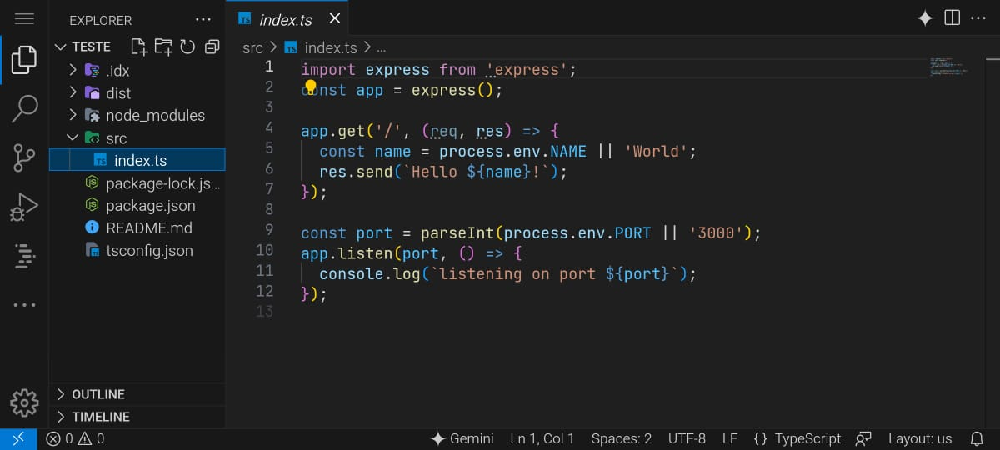
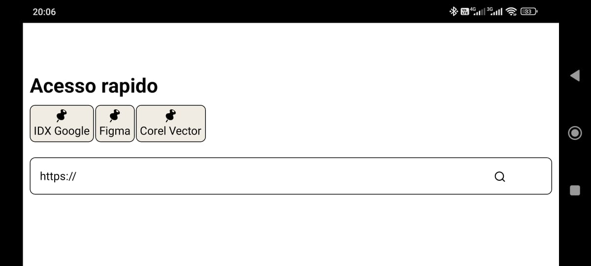
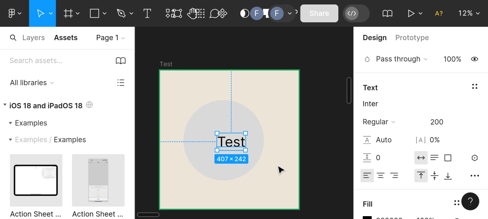

# 🌟 Projeto Acessível para Todos 🌟

👋 Olá, devs! Quero apresentar a vocês este projeto incrível, criado com o objetivo de **ajudar pessoas que não têm condições de ter um PC** para estudos. 💻🚀

Este é um projeto **simples**, mas **muito eficiente**, e tem o potencial de transformar a forma como muitos acessam conteúdos de estudo e aprendizado! 📚💡

## 📜 Sobre o Projeto

O objetivo deste projeto é oferecer uma solução acessível para pessoas que não possuem um computador, mas desejam estudar e aprender de maneira eficaz. Estamos criando uma plataforma que facilita o acesso a materiais educativos, permitindo que qualquer pessoa, independentemente de sua condição financeira, tenha acesso ao conhecimento de forma simples e eficiente.

Com este aplicativo, os usuários poderão acessar qualquer tipo de conteúdo que normalmente seria acessado em um navegador de computador, como o GitHub, Figma, e até mesmo criar aplicações usando o Google IDX (uma versão web de um editor de código que roda em nuvem). Ou seja, é possível programar, criar designs e, futuramente, navegar entre abas — tudo diretamente pelo celular!

Além disso, a plataforma requer apenas um adaptador de mouse e teclado, que custa em torno de R$17, tornando a solução extremamente acessível para todos que desejam criar e aprender, mas não têm acesso a um computador. Com esse app, qualquer pessoa poderá realizar atividades que, antes, pareciam restritas a quem tem um computador, oferecendo inclusão digital e oportunidades de aprendizado para um público ainda maior.. 🌍✨

### 💡 Missão

Nossa missão é democratizar o acesso à educação de qualidade, **reduzindo as barreiras tecnológicas** e oferecendo **ferramentas simples e eficientes** para todos. 🤝📈

---

## 🔧 Como Contribuir

Estamos contando com **sua ajuda** para fazer esse projeto se tornar algo **incrível para a comunidade**! 🚀🌍

Aqui estão algumas maneiras de contribuir:

1. 🧑‍💻 **Desenvolvendo novas funcionalidades**: Adicione novos recursos para tornar a plataforma ainda mais útil.
2. 🎨 **Melhorando o design**: Se você tem habilidades em design, contribua para tornar a interface mais agradável.
3. 📝 **Escrevendo documentação**: Ajude a melhorar a documentação para que todos possam contribuir facilmente.
4. 💬 **Divulgando o projeto**: Compartilhe com seus amigos e na sua rede para alcançarmos mais pessoas.

---

## 🛠 Tecnologias Utilizadas

Este projeto utiliza as seguintes tecnologias:
- 📦 **React Native**: Para construção de interfaces dinâmicas e eficientes.

---

## 🎯 Como Rodar o Projeto Localmente

Para rodar o projeto localmente, siga os passos abaixo:

1. Clone este repositório:
   ```bash
   git clone https://github.com/usuario/projeto-acessivel.git

## 🖼️ Print 1


## 🖼️ Print 3


## 🖼️ Print 3

